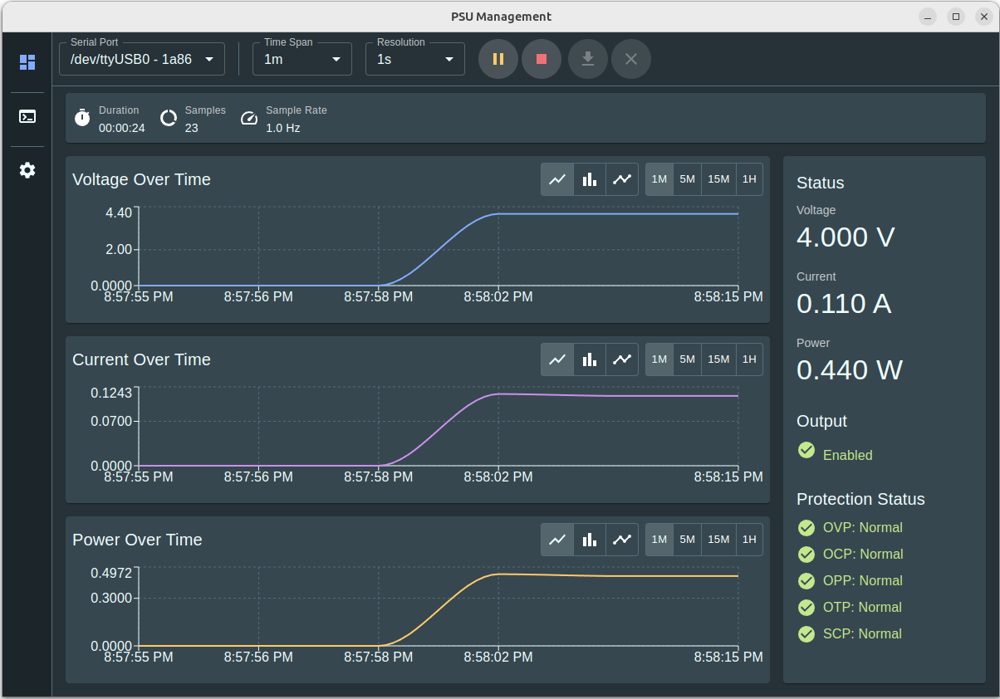
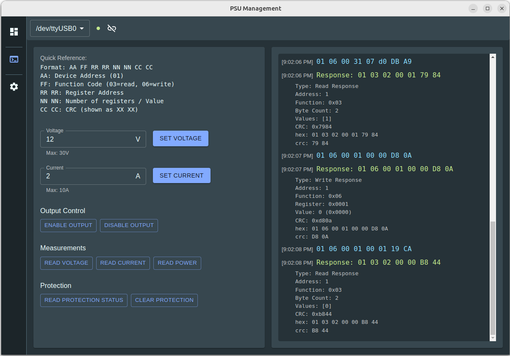
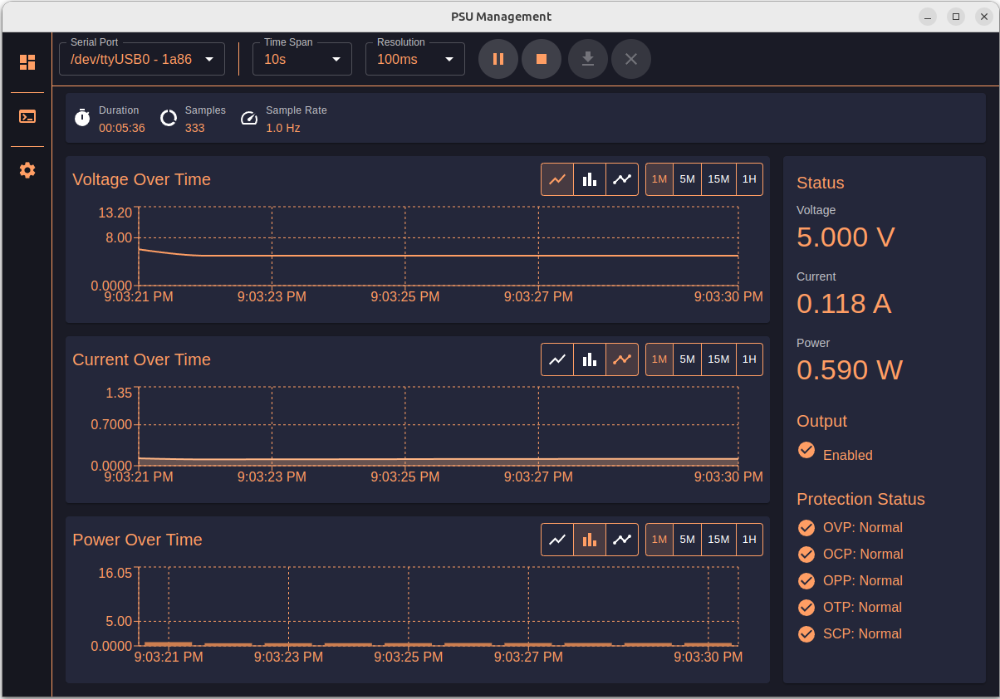
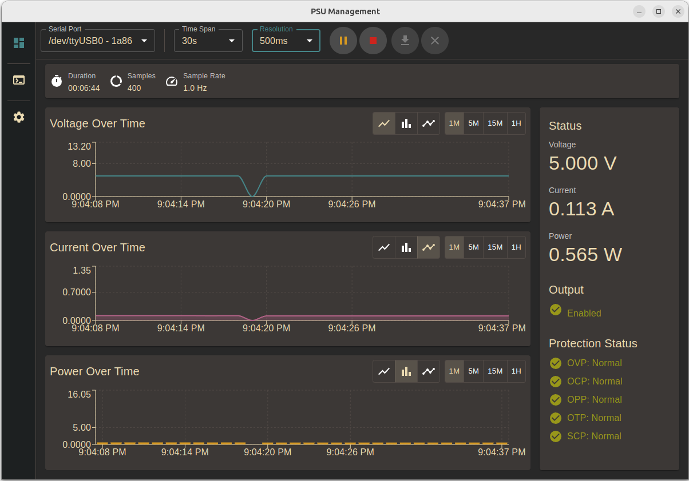
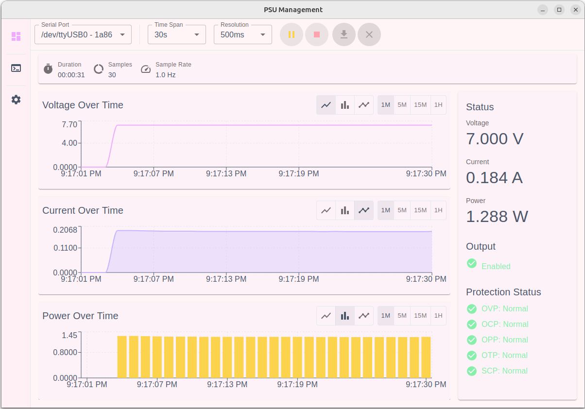
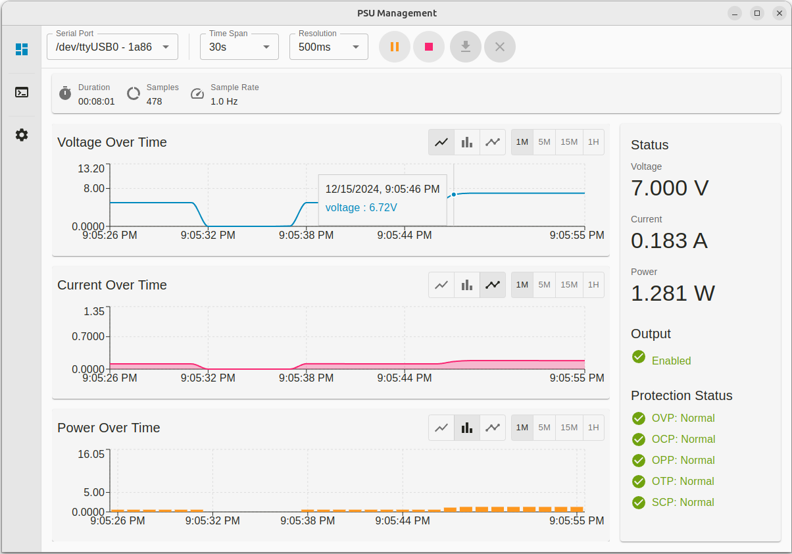

# PSU Management GUI

A modern, feature-rich desktop application for controlling and monitoring programmable DC power supplies via Modbus RTU protocol.

## Installation
The easiest way to install is to grab a release from the [Releases](https://github.com/datagoboom/psu_mgmt/releases) page.

If you'd like to build from source, see the [Building from Source](#building-from-source) section below.
## Features

- **Real-time Monitoring**
  - Live voltage, current, and power measurements
  - Graphical data visualization with multiple chart types
  - Configurable time ranges and sampling resolution
  - Protection status monitoring (OVP, OCP, OPP, OTP, SCP)

- **Data Capture**
  - Record measurements over time
  - Export data to CSV format
  - Pause/resume functionality
  - Configurable sampling rates

- **Command Center**
  - Direct Modbus command interface
  - Pre-configured common commands
  - Command history with response parsing
  - CRC calculation and verification

- **Customization**
  - Multiple theme options including:
    - Default, Agent Orange, Dracula
    - Gruvbox (Light/Dark)
    - Marshmallow, Monokai
    - Night Owl, One Dark Pro
    - Solarized (Light/Dark)
    - Tokyo Night
  - Configurable graph styles and time ranges

## Technical Details

### Architecture
- Built with Electron and React
- Uses SQLite for data storage
- Implements Modbus RTU protocol for device communication
- Material-UI for the user interface
- Recharts for data visualization

### Communication Protocol
- Modbus RTU over Serial (RS-485)
- Default settings:
  - Baud Rate: 9600
  - Data Bits: 8
  - Stop Bits: 1
  - Parity: None

### Supported Register Addresses

| Address | Description | Access | Format |
|---------|-------------|---------|---------|
| 0x0001 | Output Control | R/W | Boolean |
| 0x0002 | Protection Status | R | Bitfield |
| 0x0010 | Voltage Reading | R | Fixed Point (÷100) |
| 0x0011 | Current Reading | R | Fixed Point (÷1000) |
| 0x0012 | Power Reading | R | Fixed Point (÷1000) |
| 0x0030 | Voltage Setting | W | Fixed Point (×100) |
| 0x0031 | Current Setting | W | Fixed Point (×1000) |

### Protection Status Bitfield

| Bit | Flag | Description |
|-----|------|-------------|
| 0 | OVP | Over Voltage Protection |
| 1 | OCP | Over Current Protection |
| 2 | OPP | Over Power Protection |
| 3 | OTP | Over Temperature Protection |
| 4 | SCP | Short Circuit Protection |

### Themes
Many themes are available, including:
- Default
- Agent Orange
- Gruvbox (Light/Dark)
- Marshmallow
- Monokai
- Solarized (Light/Dark)
- Tokyo Night

## Contributing

1. Fork the repository
2. Create a feature branch
3. Commit your changes
4. Push to the branch
5. Create a Pull Request

## Building from Source

1. Clone the repository
2. Run `npm install`
4. Run `npm run dev` # for development
5. Run `npm run build:<target>` # for production

## License

[MIT License](LICENSE)

## Acknowledgments

- Built with [Electron](https://www.electronjs.org/)
- UI Components from [Material-UI](https://mui.com/)
- Graphs powered by [Recharts](https://recharts.org/)
- SQLite integration via [node-sqlite3](https://github.com/mapbox/node-sqlite3)